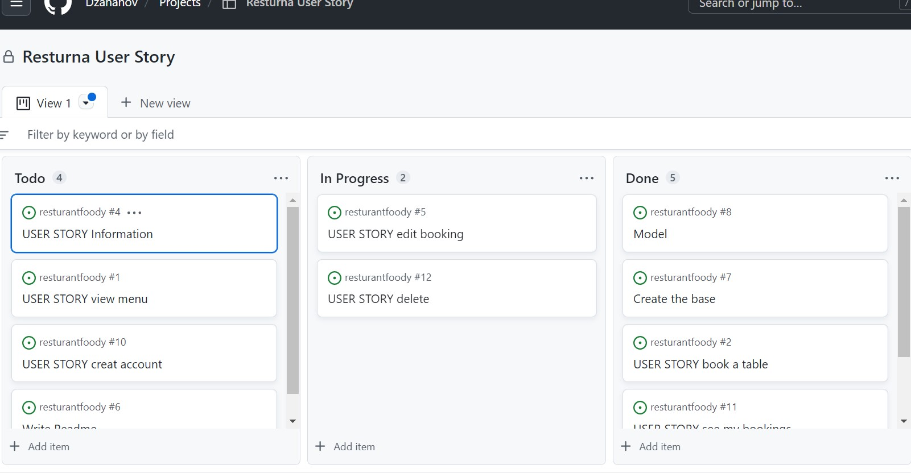

Foody Hamburger Resturant is A fictional resturante located in Malmö, Sweden. A app has been designed to informe the user about the resturant and what they can expect, give information about what kind of food the resturant serves, user are able to become members and reserve a table and afterwards users can manage their bookings

# Content
* [User Story](#User-Story)
  * [Goal](#Goal)
  * [User Stories](#User-Stories)
  * [Agil Methodolgy](#Agile-Method)
* [Design](#Design)
 * [Colour](#Colour)
 * [Font](#Font)
 * [Wireframe](#Wireframe)
* [Features](#Features)
 * [Existing-Features](#Existing-Features)
 * [Future-Features](#Future-Features)
* [Technology](#Technology)
 * [Testing] (#Testing)
 * [Bugs](#Bugs)
* [Credits](#Credits)
* [Deployment](#Deployment)

# User Story
## Goal
Goal of the site is for the resturant to provide users a management system where they can make bookings and manage them, read menu and some imformation about the returante.

## User Stories
* User should be able to sign up and later on sign in and sign out: 
As a user I can sign up so that i can sign in, sign out and book a table
* When signed in user should se a option for booking a table: 
As a sitevisiter I can book a table so that I know I have a place to sit
* When a table is booked user can manage the bookings troughout 'My page': 
As a user I can edit my booking so that I can make changes
As a user I can see my bookings so that I can manage them
As a user I can delete my booking so that I dont have that booking anymore

## Agil Method
Agil methodology aims to complete tasks in small steps. Thats the main method I used for this project. I set up my maintasks and tried to solve them one at a time. The method is designed for projects with alot of uncertinti. Where the user of the method is unsure how the outcome will happend. Therefor it is easyer to take small steps trought the project to learn what the outcome of one step will be before moving on to the next. I set up a project board with task that I had for the project to work. I had 4 main task, the 'big' tasks that the whole project evolved around. And this tasks led me to smaller tasks.

# Design

Design was choosen when the team got more clear. I have changed my design a couple of times but when I was sure about my resturante concept, it was easyer to design.

## Colour

## Font

## Wireframes
PICTURE

# Features
## Existing Features
* Nav-bar
The user can navigate troughout the page by clicking on the menu links.
* Heroimage
User will be greated by a beautiful, suiting picture.
PICTURE
* About
In the aboutsection; user can read about the resturante
PICTURE
* Menu
User can read the unique menu.
PICTURE
* Sign up
User can sign up to be able to book a table and manage bookings
PICTURE
* Sign in and sign out
User can sign in and out
PICTURES
* Manage bookings
User can manage bookings trough 'My page'. User can edit and delete bookings
PICTURE

## Future Features

* Add a function for booking a specifik table and also be able to see witch table are occupaid
* Add a function for the user to be able to order food trough the page

# Technology

## Languages
* Python
* JavaScript
* HTML
* CSS

* Frameworks
  * Python Built-in Modules

* Packages

  * cloudinary
  * dj-database-url
  * dj3-cloudinary-storage
  * Django
  * django-allauth
  * gunicorn

* Libraries
  * Balsamiq:
  * Was used to create wireframes
  * Bootstrap
  * Was used to create the front-end design.

* Programs
  * GitPod:
  * Gitpod was used as IDE to commit and push the project to GitHub.
  * GitHub:
  * Was used for all storing and backup of the code pertaining to the project.

## Testing
I did testing on my webpage troughout the project: Testings performed:

|Test | What to do | Status |
|----|:---------|:-------|
|Tried to navigate troughout the navbar | Click on all links to se if they work | good |
|Try to book a table| When I want to book a table I get asked to sign up/ log in | good |
|sign up and sign in| Tried to sign up and then sign in| good |
|Try sign in with wrong password | When i tried the wrong password I was warned| good |
|Book a table| Create a new booking and then check if it is passed on to 'My Page' | good |
|edit a booking| try the button and function edit | good |
|Delete a booking | Try the button and function delete | good |

## Bugs
|Test | What to do | Status |
|----|:---------|:-------|
|Broken navbar link | The error was in the base.html, it was not connected to the right template| fixed |
|Got a name error when trying to opend a link| Had a misspelling in the url | fixed|
|Function for redirecting to 'My page' did not work| Spelled redirect wrong| fixed |
|ProgrammingError | When trying to book a table I got a programmingerror. Fixed it by resetting the database. Probably caused by changes in the model after migrations| fixed |
|

# Deployment

# Credits

* Media
  * Pictures from Pexels
* Code
  * Code institutes walktrough project "Hello Django" Was and inspiration when building the view
  * Bootstraps documentation were used in all templates
  * Django was used for the fuctionalitis 
  * Sign in/sing up and sign out codes are from allauth and the css are from the walktrough project

