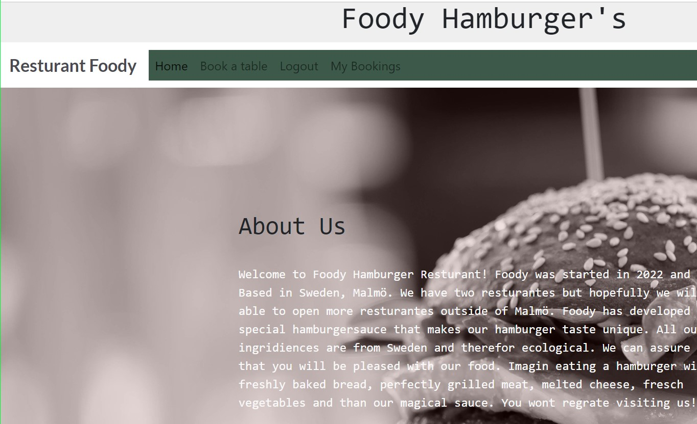

Foody Hamburger Resturant is A fictional resturante located in Malmö, Sweden. A app has been designed to informe the user about the resturant and what they can expect, give information about what kind of food the resturant serves, user are able to become members and reserve a table and afterwards users can manage their bookings

# Content
* [User Story](#User-Story)
  * [Goal](#Goal)
  * [User Stories](#User-Stories)
  * [Agil Methodolgy](#Agile-Method)
* [Design](#Design)
 * [Colour](#Colour)
 * [Font](#Font)
 * [Wireframe](#Wireframe)
* [Features](#Features)
 * [Existing-Features](#Existing-Features)
 * [Future-Features](#Future-Features)
* [Technology](#Technology)
 * [Testing](#Testing)
 * [Bugs](#Bugs)
* [Credits](#Credits)
* [Deployment](#Deployment)
 * [Heroku](#Heroku)
 * [Github](#Github)

# User Story
## Goal
Goal of the site is for the resturant to provide users a management system where they can make bookings and manage them, read menu and some imformation about the returante.

## User Stories
* User should be able to sign up and later on sign in and sign out: 
As a user I can sign up so that i can sign in, sign out and book a table
* When signed in user should se a option for booking a table: 
As a sitevisiter I can book a table so that I know I have a place to sit
* When a table is booked user can manage the bookings troughout 'My page': 
As a user I can edit my booking so that I can make changes
As a user I can see my bookings so that I can manage them
As a user I can delete my booking so that I dont have that booking anymore

## Agil Method
Agil methodology aims to complete tasks in small steps. Thats the main method I used for this project. I set up my maintasks and tried to solve them one at a time. The method is designed for projects with alot of uncertinti. Where the user of the method is unsure how the outcome will happend. Therefor it is easyer to take small steps trought the project to learn what the outcome of one step will be before moving on to the next. I set up a project board with task that I had for the project to work. I had 4 main task, the 'big' tasks that the whole project evolved around. And this tasks led me to smaller tasks.

# Design

Design was choosen when the team got more clear. I have changed my design a couple of times but when I was sure about my resturante concept, it was easyer to design.  I went for a feeling of modern, neutral, nostaligcal feeling that is pleasent to look at

## Wireframes
My first outcast of wirefram looks like this. Then I worked with this wirefram as my base and the improved it so it would fit the concept.

# Features
## Existing Features
* Nav-bar
The user can navigate troughout the page by clicking on the menu links. User can only see three navbar links when not loged in. 'Home', ' Book a Table' and 'Sign in'. When clicked on 'Book a Table' User can only choose by singing in or singing up. This to be able to check out the rest of the page
* Heroimage
User will be greated by a beautiful, suiting picture.
* About
In the aboutsection; user can read about the resturante and what the resturant offers. This can be seen even when not loged in.
* Menu
User can read the unique menu adn choose what kind of food we offer. This can be done even when not loged in
* Sign up
User can sign up and become a member of Foody Resturant. When a member user can book tables and will get discount codes to email every now and then. Also news and other interestings facts will be sent to every member.
* Sign in and sign out
If user is a member he or she can sign in and book a table right away. User can also sign out. The 'Sign out' link on the nav bar is only visible for loged in users.
* Book a table. Users who are signed in can choose to book a table. When booked successfully, user will be redirected to the 'My Bookings' page(wich is also only visible for loged in users). User can make more than one booking in his or her name.
* Manage bookings
User can manage their bookings on their 'My Booking' Page. They can edit and delete bookings. When editing a booking  user will be redirected to a booking form again where they can edit their booking. And also save the booking. When they save they will be redirected back to 'My bookings' page. on 'My Bookings' They can also choose to delete the booking. The booking will just disappear then.

## Future Features

* Add a function for booking a specifik table and also be able to see witch table are occupaid
* Add a function for the user to be able to order food trough the page

# Technology

## Validator

* PEP8 check. I had some error regarding the to long lines in my codes. But also I got error for not having a whitespace around operator '=' on line 22,24,25,55. If I put I whitespace there my code do not work proparly.

* W3 HTML Validator: I got errors on all my static files. I choose to ignore them because the images worked just fine.

* Jigsaw validator for CSS o errors detected

## Languages
* Python
* JavaScript
* HTML
* CSS
 

* Frameworks
  * Python Built-in Modules

* Packages

  * cloudinary
  * dj-database-url
  * dj3-cloudinary-storage
  * Django
  * django-allauth
  * gunicorn

* Libraries
  * Balsamiq:
  * Was used to create wireframes
  * Bootstrap
  * Was used to create the front-end design.

* Programs
  * GitPod:
  * Gitpod was used as IDE to commit and push the project to GitHub.
  * GitHub:
  * Was used for all storing and backup of the code pertaining to the project.
## Supported frames
The website is responsive and is tested on iPhone SE, Ipad Mini and regular desktop.
## Testing
I did testing on my webpage troughout the project: Testings performed:

|Test | What to do | Status |
|----|:---------|:-------|
|Tested my database | on Herouku i clicked on resources on the navbar and than on the added postgres link. It will display a page with a succsess message  | good |
|Tried to navigate troughout the navbar | Open my webpage and tried to click on my navbar links and when one worked I pressed the 'Home' and then I went on to the other navbar link| good |
|Try to book a table| When i am not logged in and click on the 'Book a Table' navbar link I will be redirected to another page saying I have to sign in or sign up as a member| good |
|sign up and sign in| I first try to fill in the sign up form on the page and then I click submit. on my navbar will change and show 'Book a Table', 'Sign Out' and 'My Bookings'.| good |
|Try sign in with wrong password | I log out and click on 'Book a Table' link on the navbar and then i click on the link 'Sign In'. I get redirectewd to another page where I can fill out my username and password. I try to fill out the wrong password. I get a meesage saying I cannot log in because invalid username or password. I then fill oput the right information and I log in succsessfully| good |
|Book a table| I then click on the navbar link ' Book a Tabel' I get redirected to a page with a booking form. I fill it out and click 'Book' I then get redirected to 'My Bookings' Page with a message saying my booking was confirmed. I can also se my booking on the 'My bookings' page.| good |
|edit a booking| Under my booking on 'My Bookings' Page I can se a button for edit. When I click on that i get redirected to my bookingform again and there I can change something in the booing and than sav changes, When saved I get redirected back to 'My bookings' | good |
|Delete a booking | Beside the 'Edit' button I have a 'Delete' button. I try to click on it and my booking will disappear| good |

TestCase 1

TestCase 3
Sign up form

TestCase 4

TestCase 5 

TestCase 6

TestCase 7

## Bugs
|Test | What to do | Status |
|----|:---------|:-------|
|Broken navbar link | The error was in the base.html, it was not connected to the right template. Insted of href=' It just said href=#.| fixed |
|Got a Template dose not exist error when trying to opend 'My Bookings' page in the navbar| Had not yet connected my view function for the 'My Bookings' to an URL path in URL in the bookAtable folder | fixed|
|Function for redirecting to 'My page' did not work| when I was writing my book_a_table function I wrote 'return redirect('my page') when I should have written ('my_page') the underscore was missing and was throwing an error.| fixed |
|ProgrammingError | When trying to book a table I got a programmingerror. Fixed it by resetting the database. I did it trough heroku. Went to resources on my heroku page, then clicked on the postgres link and clicked on 'Reset database'. Later I had to creat a new superuser and also makemigrations and migrate again. Probably caused by changes in the model after migrations| fixed |
|

# Deployment
## Heroku

  * Logged in to my account on herouku
  * At dashboard I created a new app called "ResturantFoody" and chose region Europe
  * In Resources I searched for PostGres in the add-ons to use as my database
  * In settings I revelde my config vars at the same time I created a new file on my workspace called env.py to store my envoiroments
  * I Connected the database from Herouku(confik vars) and past them in my env.py and I also created a secret key in env.py and copy past the same in my config vars.
  * I referenced this in settings.py
  * I added the value of 8000 and key to config vars
  * I connected cloudinary to env.py and my herouku with the same value and key
  * Added Allowed Hosts in settings
  * Went to the deploytab in herouku
  * searched for my github repo(my github was already connected)
  * Then clicked on deploy branch 

## Github
  * Go to settings
  * Click on pages at the sidebar
  * Choose to save on 'main'
  * Save

# Credits

* Media
  * Pictures from Pexels
* Code
  * Code institutes walktrough project "Hello Django" Was and inspiration when building the view
  * Bootstraps documentation were used in all templates
  * Django was used for the fuctionalitis 
  * Sign in/sing up and sign out codes are from allauth and the css are from the walktrough project
  * Footer CSS from "I think therefor I blog" And the same for alert messages code and function in the base.html

## Thanks to
* Code Institution for education
* My mentor for mentroing and pushing me to always try my best
* Tutor support for all help resolving issus

